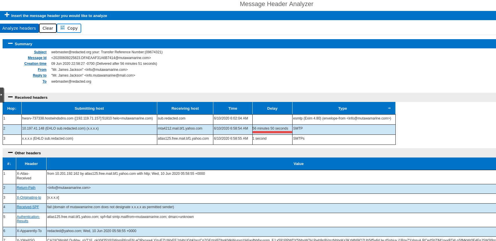
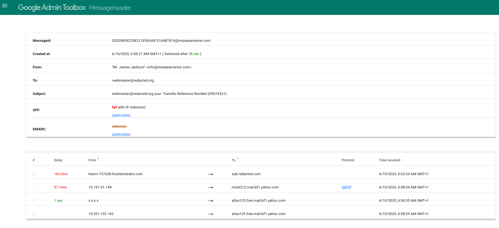
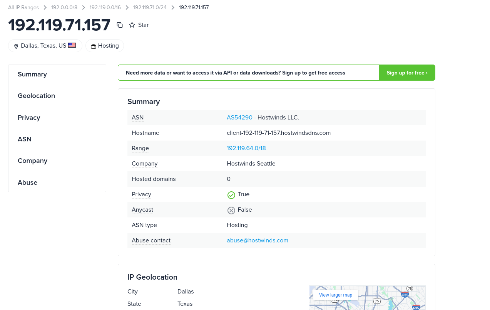
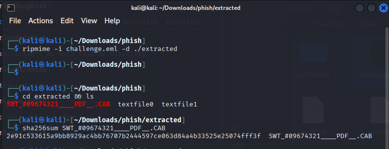
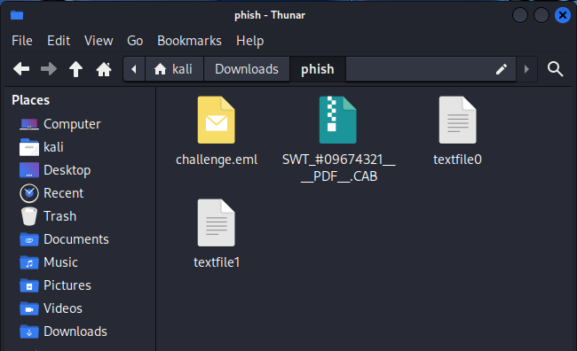
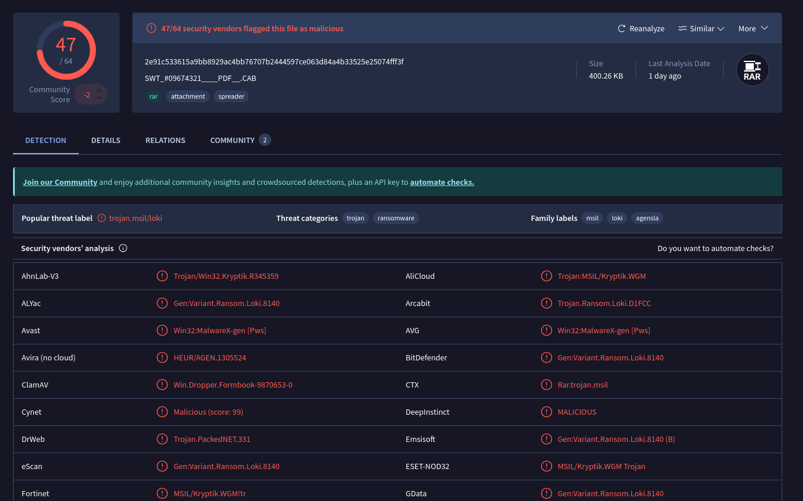

# Phishing Email Analysis — The Greenholt Phish Challenge (TryHackMe)

## Objective  
Perform a phishing investigation on a malicious email sample and identify indicators of compromise (IOCs) and malicious attachments.

---

## Key Tasks Performed

### Extracted full email headers  
Analyzed the `.eml` headers using Google Admin Toolbox Message Header Analyzer and Microsoft Header Analyzer.

---

### Identified the Return-Path and SPF domain  
Reviewed the header fields to find the Return-Path domain and the SPF-checking domain.

---

### Analyzed SPF, DKIM, and DMARC authentication results  
Authentication results indicated that SPF and DMARC checks failed.

---

### Examined Received headers to trace the sender’s origin IP  
The originating sender IP was extracted from the Received chain and investigated using ipinfo.io.

---

### Safely extracted attachments using ripmime  
The attachment was extracted safely from the `.eml` file using ripmime.

---

### Calculated SHA-256 hash and performed Threat Intelligence lookup  
The attachment hash was calculated using `sha256sum` and submitted to VirusTotal for analysis.

---

## Findings

- SPF and DMARC authentication failed, indicating spoofing  
- VirusTotal results showed the attachment was malicious

---

## Tools Used

- ripmime  
- sha256sum  
- file  
- VirusTotal  
- ipinfo.io  
- Microsoft Header Analyzer 
- Google Admin Toolbox Header Analyzer  

---

## Conclusion

Determined through header analysis, authentication checks, Threat Intelligence lookups, and attachment triage that the email was a phishing attack with a malicious payload, designed to compromise the recipient’s system and/or credentials.
